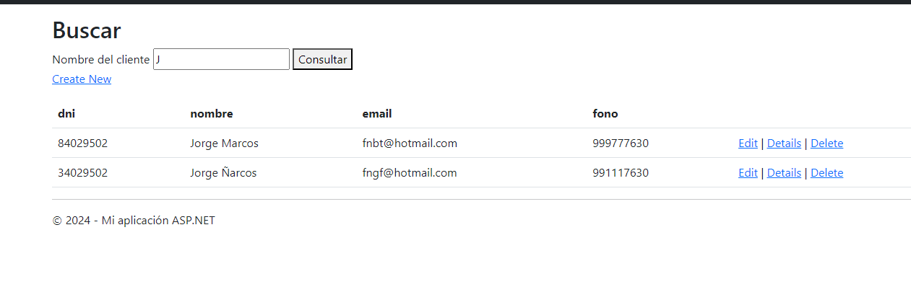

# Gestión de Clientes
Este proyecto es una aplicación web MVC desarrollada en C# utilizando Visual Studio 2022. Permite buscar y listar clientes a partir de una lista predefinida de datos.

## Imagen del Proyecto

## Características
- **Listado de Clientes:** Muestra una lista completa de clientes con sus detalles como DNI, nombre, email y teléfono.
- **Búsqueda de Clientes:** Permite buscar clientes por nombre, mostrando los resultados que coinciden parcial o totalmente con el nombre ingresado.

## Tecnologías Utilizadas
- Lenguaje de Programación: C#
- Framework: ASP.NET MVC
- Entorno de Desarrollo: Visual Studio 2022
- Paradigma: Programación Orientada a Objetos (POO)

## Uso
- Navega a la página de listado de clientes (/Vistas/Listado).
- Para buscar clientes, navega a la página de búsqueda (/Vistas/Buscar).
- Ingresa el nombre del cliente en el campo de búsqueda y presiona "Consultar" para ver los resultados.
